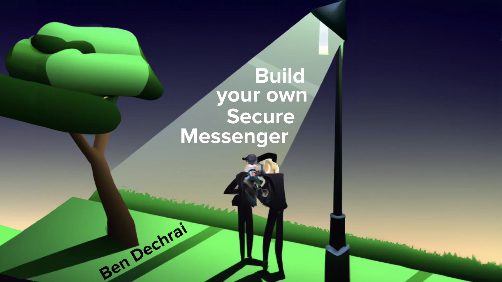

# Build your own Secure Messenger

This project is the basis of [Ben Dechrai](https://bendechrai.com/)'s workshop by the same name.

By the end of this workshop, you will have created a React-based Single Page Application that allows authenticated users to send messages securely between each other.

## :technologist: Prerequisites

In order to get the most from this workshop, you will

- be comfortable using VS Code as a development environment
- have a moderate understanding of JavaScript

## 🗝 Key

| Symbol | Description |
| ------ | ----------- |
| 👉&nbsp;ACTION | It's time to take an action. If all you do is follow these lines, you will complete the workshop. |
| 🧪&nbsp;CHECK&nbsp;POINT | It's time to confirm something's working. It's a good idea to check these, rather than jump from ACTION to ACTION, so that you can identify an issue early on. |
| _💡&nbsp;TIP_ | Extra information should you want it. Skipping these will not affect your ability to complete the workshop. |
| _⚠&nbsp;LOOK&nbsp;OUT_ | Get a heads up about something that might not be obvious. Think of this as a TIP that's a bit more important to read. |                            |

## :book: Workshop Steps

0. [Pre-Workshop Setup](STEP-0-PRE-WORKSHOP.md)
1. [Setting up your development environment](STEP-1-DEVELOPMENT-ENVIRONMENT.md)
2. [Get the starter application working](STEP-2-STARTER-APP.md)
3. [Create a Public/Private Keypair](STEP-3-CREATE-A-PUBLIC-PRIVATE-KEYPAIR.md)
4. [Encrypting Messages](./STEP-4-ENCRYPTING-MESSAGES.md)
5. [Decrypting Messages](./STEP-5-DECRYPTING-MESSAGES.md)
6. [Testing Multi-User Cryptography](./STEP-6-TESTING-MULTIUSER-CRYPTOGRAPHY.md)
