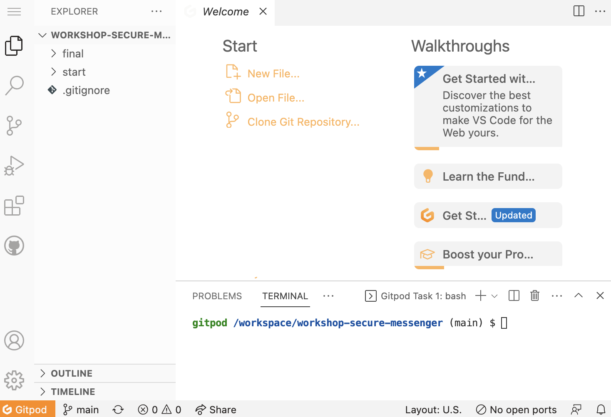

# Write Your Own Web Store In Hours

_💡&nbsp;TIP: You're welcome to do this before the workshop too, but we will start here as a group anyway._


## Launch this workshop in a web-based code editor

> GitPod is a web-based development environment based on Visual Studio Code for the Web. By using this, you won't need to worry about setting up a local development environment on your laptop to take part in this workshop.

👉 ACTION: [Launch this workshop in GitPod](https://gitpod.io/#github.com/bendechrai/workshop-secure-messenger), and login with GitHub when prompted.

_💡&nbsp;TIP: If this is your first time using GitPod, you'll be taken through an onboarding process. You'll be fine choosing the defaults._

🧪&nbsp;CHECK&nbsp;POINT: You're ready to move on when you can see the code editor:




## ⚙️ Install the Netlify CLI

_💡&nbsp;TIP: We're not going to be deploying to Netlify, but we do want to use the Netlify developer tools so that the lambda functions we write today can be served locally for testing._

👉 ACTION: In the terminal window at the bottom of the in-browser IDE, install Netlify's command line (CLI) tools:

```shell
npm install netlify-cli -g
```

_⚠&nbsp;LOOK&nbsp;OUT: If you restart your GitPod instance, you might need to reinstall the Netlify CLI again._


---

[▶️ STEP 2: Get the starter application working](STEP-2-STARTER-APP.md)

_[⎌ Back to step 0: Pre-Workshop Setup](STEP-0-PRE-WORKSHOP.md)_