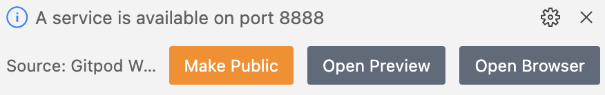
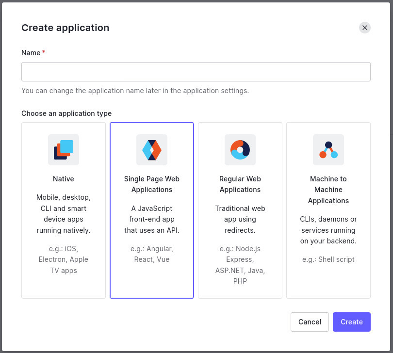
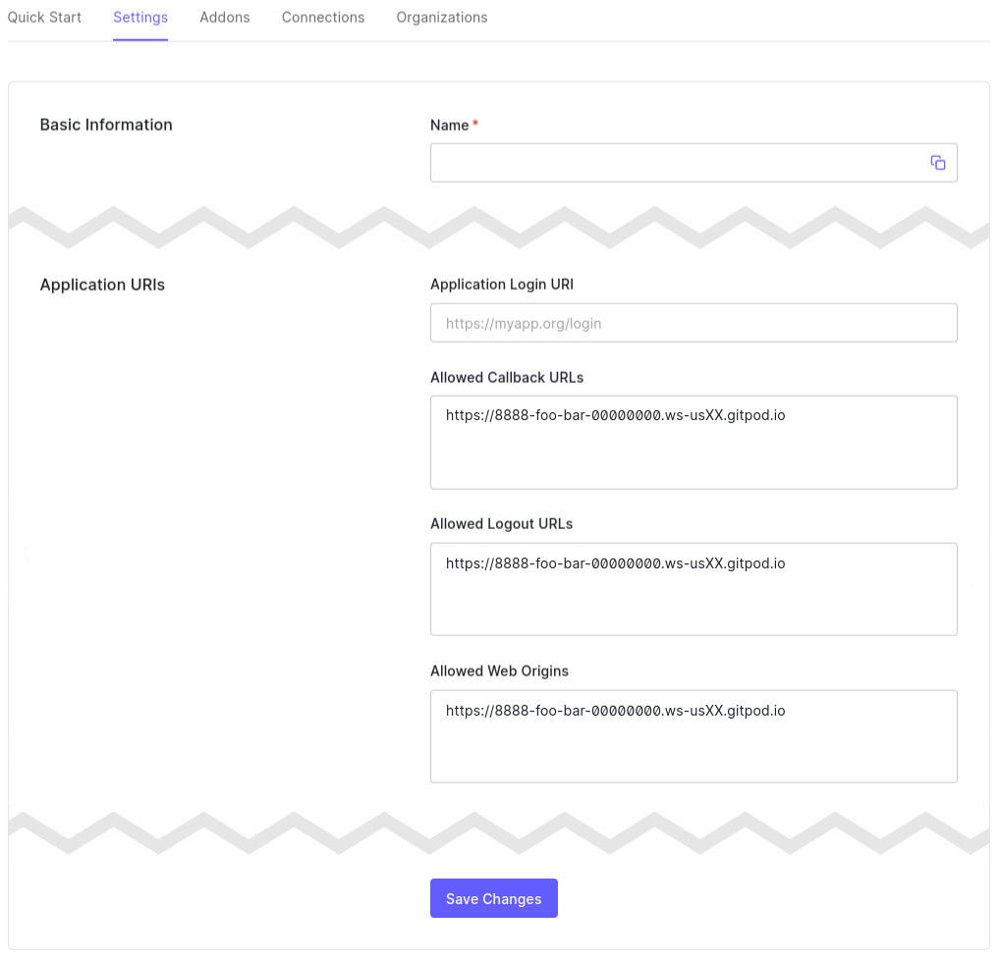
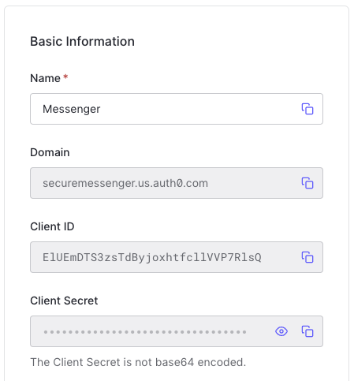
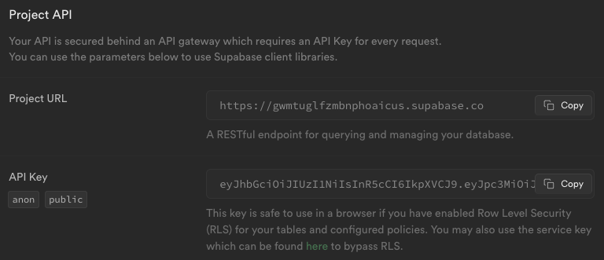

# Build your own Secure Messenger

_💡&nbsp;TIP: This is the big page - this will get the Messenger App working without encryption, as a starting point to adding encryption._


## Install Dependencies

👉 ACTION: In the terminal window at the bottom of the in-browser IDE, type the following:

```
cd start
npm install
netlify dev
```

When the app is running, you'll see a couple of ports announce their availability.

👉 ACTION: Click **"Open Browser"** when you see the service on port 8888 become abailable:



_💡&nbsp;TIP: Another service will be running on port 3000. You don't want this one._

🧪&nbsp;CHECK&nbsp;POINT: You will see a big error message. This is expected at this point.

👉 ACTION: Copy the URL of the error page. This is your Messenger App URL and you'll need it in the next steps.


## Create an Auth0 Application

👉 ACTION: In the Auth0 dashboard, [create a new Application](https://manage.auth0.com/#/applications), and make sure you make it of type "Single Page Web Application".

> 📷 **_The Auth0 "Create Application" modal_**
>
> 


## Configure the application in Auth0

👉 ACTION: Go to the settings tab and set the **Allowed Callback URLs**, **Allowed Logout URLs**, and **Allowed Web Origins** to you Messenger App URL (the URL of your error page above), removing the last slash. It will look something like `https://8888-foo-bar-00000000.ws-usXX.gitpod.io`

_⚠&nbsp;LOOK&nbsp;OUT: Remember to scroll to the bottom and click **Save Changes**._

> 📷 **_The URLs we need to set in the Auth0 Dashboard_**
>
> 

_💡&nbsp;TIP: Essentially, this is telling Auth0 that it should only talk to your web application._


## Configure Auth0 to add `user_metadata` to logged in users' ID Tokens

_💡&nbsp;TIP: Auth0 lets you store extra metadata about users, which we'll do later. It's not part of a standard ID Token though, so let's make sure it's available to our app._

👉 ACTION: Go to the **"Actions"** > **"Library"** section in your Auth0 management dashboard, click on **"Build Custom"** and call it **"Add Metadata"** and make sure it's a **"Login / Post Login"** trigger type. Then update the `exports.onExecutePostLogin` function to the following, and finish by clicking the **"Deploy"** button.

```js
exports.onExecutePostLogin = async (event, api) => {
  api.idToken.setCustomClaim("http://localhost:8888/user_metadata", event.user.user_metadata);
};
```

👉 ACTION: Go to the **"Actions"** > **"Flows"** section in your Auth0 management dashboard, click on **"Login"** find the **"Add Metadata"** action under the **"Custom"** tab on the right. Drag the action into the flow diagram in the center of the screen and click **"Apply"** in the top right.


## Create your Supabase tables

👉 ACTION: Go to your [Supabase Project listing page](https://app.supabase.com/projects) and click **"New project"**.

_💡&nbsp;TIP: Just fill in the **"Name"** and **"Database Password"** fields and click **"Create new project"**._

🧪&nbsp;CHECK&nbsp;POINT: Wait until the project has been fully created and the welcome message shows.

👉 ACTION: Under **"Welcome to your new project"**, click on **"SQL editor"**. On the next page, select the **"Create table"** script and replace the placeholder SQL with the following, and click **"RUN"**.

```sql
create table messages (
  id serial primary key,
  sender text not null,
  message text not null,
  created_at timestamp default now()
);

begin;
drop publication if exists supabase_realtime;
create publication supabase_realtime;
commit;

alter publication supabase_realtime add table messages;
```


## Create a `.env` file

_💡&nbsp;TIP: We need to store some configuration for your app._

👉 ACTION: Create a `.env` file in the `start` folder and replace with values for your Auth0 tenant and Supabase project:

```yaml
REACT_APP_AUTH0_DOMAIN=<Auth0 - Basic Info - Domain>
REACT_APP_AUTH0_CLIENTID=<Auth0 - Basic Info - Client ID>
REACT_APP_SUPABASE_URL=<Supabase URL>
REACT_APP_SUPABASE_KEY=<Supabase Key>
```

_💡&nbsp;TIP: The Auth0 values can be found near the top of the settings page in the "Basic Info" section._



_💡&nbsp;TIP: The Supabase values can be found by clicking on the ⚙️ icon in the left menu to go to the project settings, and to the **"API"** sub-menu:_




## Restart `netlify dev`

👉 ACTION: In the terminal in the in-browser IDE, press `ctrl-c` to stop the web server, and restart is again with:

```shell
netlify dev
```

_💡&nbsp;TIP: This action re-reads the `.env` file so the React application has access to these environment variables._


## Update your application to require authentication

👉 ACTION: Edit the last line of `start/sc/App.js` to read:

```js
export default withAuthenticationRequired(App);
```

🧪&nbsp;CHECK&nbsp;POINT: Refresh the tab running your Messenger App, and you should be presented with a login page.

👉 ACTION: Click on **"Sign up"** and create yourself an account.

_💡&nbsp;TIP: If you're asked to **Authorize App**, click **"Accept"**. This allows your Messenger App to get information about the user, which will be important soon._


## Test your application!

🧪&nbsp;CHECK&nbsp;POINT: You should see a messaging system and the ability to write a new message. Send a message and it shoudl appear.


---

[▶️ STEP 3: Create a Public/Private Keypair](./STEP-3-CREATE-A-PUBLIC-PRIVATE-KEYPAIR.md)

_[⎌ Back to step 1: Setting up your development environment](STEP-1-DEVELOPMENT-ENVIRONMENT.md)_
