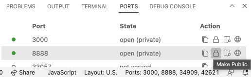
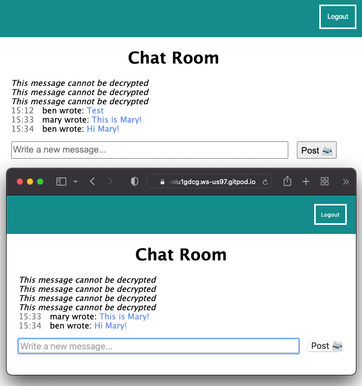

# Build your own Secure Messenger

## Open your GitPod URLs to the public

_💡&nbsp;TIP: By default, GitPod protects you by only allowing you to visit your apps in development from the browser that you're editing the code in. We want to open the app in a different browser so we can log in as two users at the same time._

👉 ACTION: In the GitPod in-browser IDE, find the **"PORTS"** tab in the bottom frame, and click on the padlock icon for port 8888 so that it changes to an open padlock icon:

## Open your Messenger App in another browser

👉 ACTION: Pick a different browser, or open a private browser instance, and go to your Messenger App URL. You'll be prompted to log in.

👉 ACTION: Create a new user with a dummy email address. Use `mary@example.com`, unless your name is Mary, in which case choose another `@example.com` email address. This way, you'll be able to see two different user names in the chat channel.

👉 ACTION: Provide a passphrase for this new user's keypair, then send a message to the channel.

🧪&nbsp;CHECK&nbsp;POINT: You should see your new message in both windows for both users, but not be able to read previous messages for the new user. That's because the new user's public key didn't exist at the time they were sent.

## Did everything work??

Hopefully, you've gotten to the end and have a functioning app. If not, grab some help in the workshop and we'll see if we can work out where things went awry.

## 🕵️ What's missing?

This workshop has given you the basics to understand how public/private encryption works, but there's only so much you can cover in a couple of hours. It is designed to give you a comprehension of the possibilities, but it not intended to be production ready code.

There are certainly conversations to be had about the suitability of storing private keys on 3rd-party servers, and this workshop should not be considered to be condoning this for all use-cases. As always, your mileage might vary, and you should consult a security professional before considering this approach.

It is my hope that you have learned something about encryption, ways that you can keep your data secure, and even remove the ability for you to see your users data where appropriate.

If you use any of this material or knowledge to help you in your project, I'd love to hear from you. My [Twitter DMs](https://twitter.com/bendechrai) are open, or you can [message me on Bluesky](https://bsky.app/profile/bendechrai.com).

---

_[⎌ Back to step 5: Decrypting Messages](./STEP-5-DECRYPTING-MESSAGES.md)_